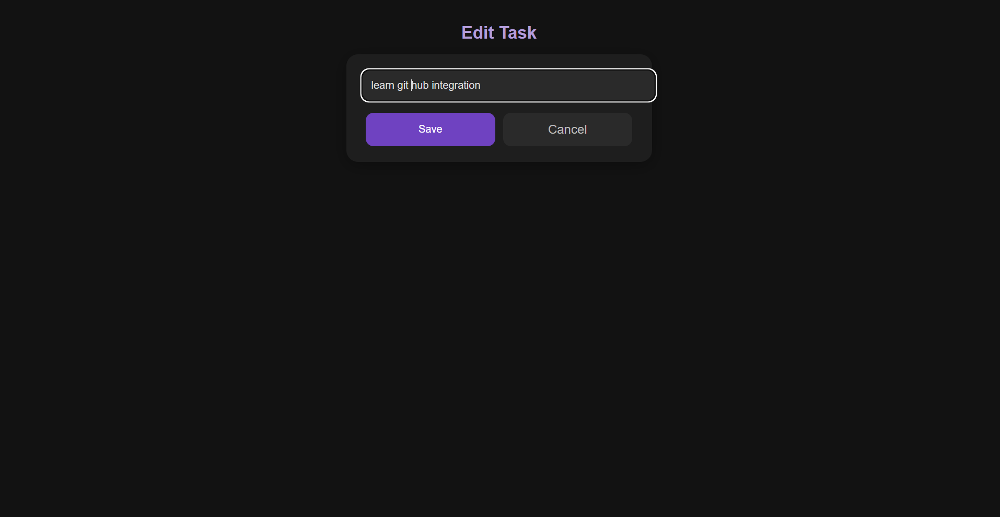
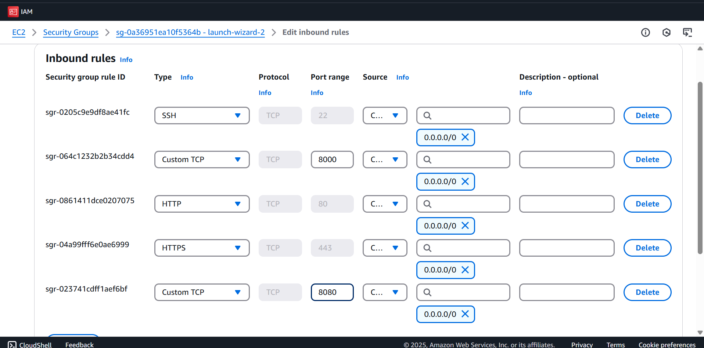
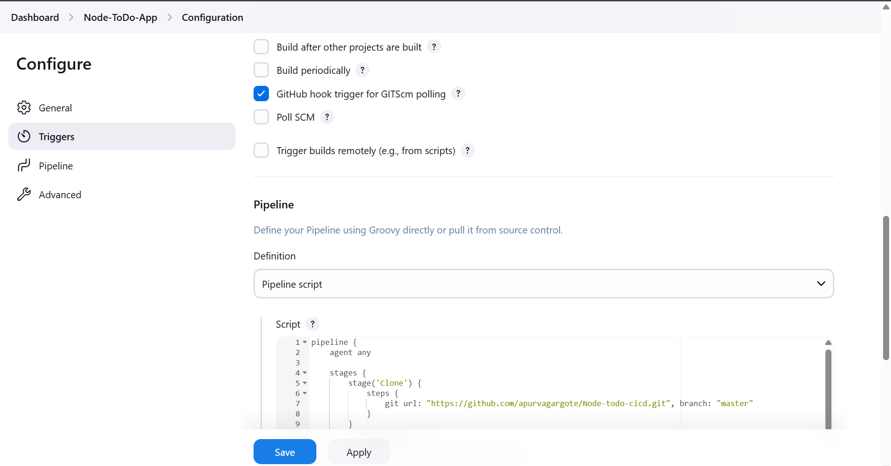
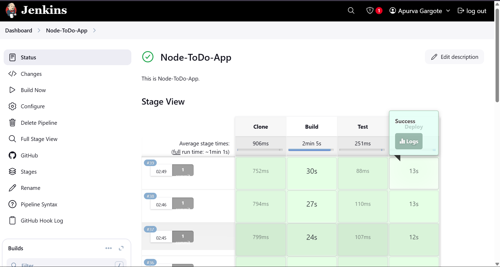

# **Jenkins CI/CD Pipeline Setup on AWS EC2**



## 📌 **Key Objectives**
- Set up an EC2 instance and configure Jenkins.
- Install and configure Docker for containerized deployments.
- Implement a Jenkins Pipeline for CI/CD automation.
- Configure GitHub Webhooks to trigger builds automatically.
- Deploy and manage a Node.js Todo App using Jenkins and Docker.

---

## 1. **Set Up EC2 Instance**
- Launch an **Ubuntu EC2** instance.
- Connect to the instance via SSH:
  ```bash
  ssh -i your-key.pem ubuntu@your-ec2-ip
  ```
  This establishes a secure connection to the remote EC2 instance.

---

## 2. **Install Java (Required for Jenkins)**
- Refer to the official OpenJDK documentation: [OpenJDK Installation Guide](https://www.jenkins.io/doc/book/installing/)
- Run the following command:
  ```bash
  sudo apt update
  sudo apt install fontconfig openjdk-17-jre
  java -version
  openjdk version "17.0.13" 2024-10-15
  OpenJDK Runtime Environment (build 17.0.13+11-Debian-2)
  OpenJDK 64-Bit Server VM (build 17.0.13+11-Debian-2, mixed mode, sharing)
  ```
  Jenkins requires Java to run, and OpenJDK 21 is the latest stable version.

---

## 3. **Install Jenkins**
- Refer to the official Jenkins documentation: [Jenkins Installation Guide](https://www.jenkins.io/doc/book/installing/)
- Run the following commands:
  ```bash
  curl -fsSL https://pkg.jenkins.io/debian/jenkins.io-2023.key | sudo tee \
    /usr/share/keyrings/jenkins-keyring.asc > /dev/null

  echo deb [signed-by=/usr/share/keyrings/jenkins-keyring.asc] \
    https://pkg.jenkins.io/debian binary/ | sudo tee \
    /etc/apt/sources.list.d/jenkins.list > /dev/null

  sudo apt install -y jenkins
  sudo systemctl start jenkins
  sudo systemctl enable jenkins
  ```
  Installs Jenkins, starts the service, and ensures it runs on system boot.

---

## 4. **Install Docker**
- Refer to the official Docker documentation: [Docker Installation Guide](https://docs.docker.com/engine/install/ubuntu/)
- Run the following commands:
  ```bash
  sudo apt install -y docker.io
  sudo systemctl enable docker
  sudo systemctl start docker
  ```
  Docker is required to build and deploy containerized applications.

---

## 5. **Add Current User to Docker Group**
- Run the following commands:
  ```bash
  sudo usermod -aG docker $USER
  newgrp docker
  ```
  Grants the current user permission to run Docker commands without `sudo`.

---

## 6. **Allow Required Ports in Security Group**
### ✅ **Allow Port 8080 for Jenkins**
- In AWS EC2 Security Group, allow:
  ```bash
  Port 8080 → For Jenkins
  ```
  This allows external access to the Jenkins web interface.

### ✅ **Allow Port 8000 for the Todo App**
- In AWS EC2 Security Group, allow:
  ```bash
  Port 8000 → For the Todo App
  ```
  This ensures the deployed application is accessible.

---

## 7. **Login to Jenkins**
- Open Jenkins in a browser:
  ```bash
  http://your-ec2-ip:8080
  ```
- Retrieve the initial admin password:
  ```bash
  sudo cat /var/lib/jenkins/secrets/initialAdminPassword
  ```
  Grants access to the Jenkins UI for initial setup.

---

## 8. **Create a New Item in Jenkins**
- Navigate to **New Item** → Select **Pipeline** → Name it **Todo-CICD** → Click **Save**.
  This sets up a new pipeline job for CI/CD automation.

---

## 9. **Add Jenkins Pipeline**
- Inside Jenkins, go to the **Pipeline** section and paste the following:
  ```groovy
  pipeline {
      agent any

      stages {
          stage('Clone') {
              steps {
                  git url: "https://github.com/apurvagargote/Node-todo-cicd.git", branch: "master"
              }
          }
          stage('Build') {
              steps {
                  sh "docker build -t todo-app ."
              }
          }
          stage('Test') {
              steps {
                  echo 'Tests Passed'
              }
          }
          stage('Deploy') {
              steps {
                  sh '''
                  docker stop todo-app || true
                  docker rm todo-app || true
                  docker run -d -p 8000:8000 --name todo-app todo-app
                  '''
              }
          }
      }
  }
  ```
  Defines the CI/CD process to clone the repository, build the image, run tests, and deploy the application.

---

## 10. **Enable GitHub Webhook in Jenkins**
- Navigate to **Manage Jenkins** → **Configure System**.
- Scroll down to **GitHub** and check **GitHub Webhook Trigger for GITScm Polling**.
- Click **Save**.
  This ensures Jenkins automatically triggers builds when changes are pushed to the GitHub repository.

---

## 11. **Add GitHub Webhook**
- Go to **GitHub Repo** → **Settings** → **Webhooks** → **Add Webhook**.
- Set the **Payload URL**:
  ```bash
  http://your-ec2-ip:8080/github-webhook/
  ```
- Set **Content type** to `application/json`.
- Select **Trigger** → Just the push event.
  This notifies Jenkins whenever new code is pushed to the repository.

---

## 12. **Build the App**
- Click **Build Now** in Jenkins.
- Verify the app is running:
  ```bash
  http://your-ec2-ip:8000
  ```
  
  This triggers the pipeline and deploys the application successfully.

---
## 13. **Install Stage View Plugin**
- In **Jenkins**, go to **Manage Jenkins** → **Manage Plugins** → Install **Pipeline Stage View**.
  Enhances the visibility of pipeline execution stages.

